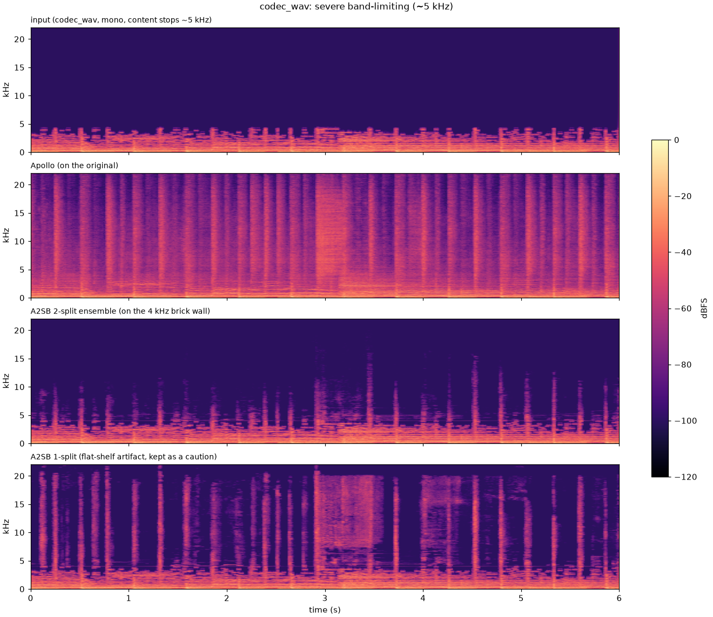
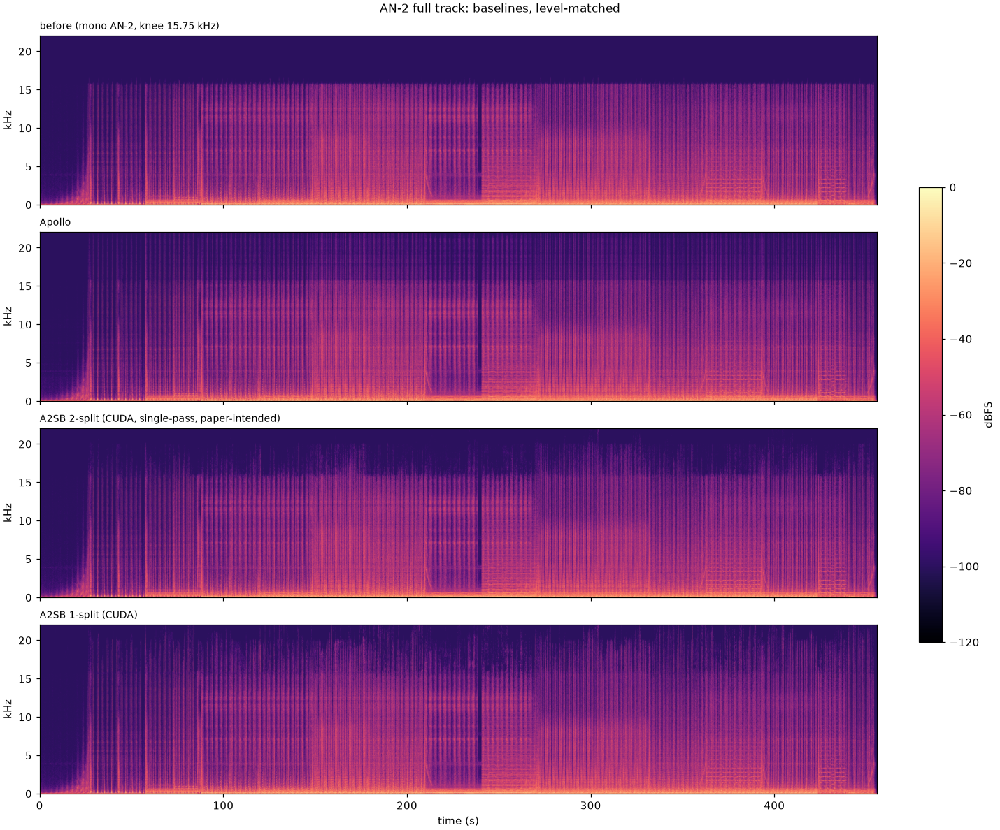

# 6. Baseline findings: Apollo and A2SB on library material

Date: 2026-08-17

## Status

Proposed — speaker listening and the Mac inference issue still open

## Context

First results from running the ADR-0005 baselines on real material. Two test files:

- **AN-2 — Moonshine** (7.6 min, 128 kbps MP3 rip, mono for A2SB comparability). Bandwidth stops at 15.75 kHz.
  This is what most of the library looks like.
- **codec_wav** (6 s, Apollo's own test asset, content stops around 5 kHz; brick-walled at 4 kHz for A2SB).
  The severe case.

Everything is compared level-matched at −14 LUFS with one common headroom gain, so nothing clips and no comparison
is decided by loudness.

## Apollo

- Restores a lot, everywhere: +10–15 dB above 16 kHz on AN-2, ~+48 dB across 5–22 kHz on codec_wav. Below the
  cutoff it changes nothing.
- Fast and local: faster than realtime on the MacBook, native stereo, and the stereo image survives.
- Slightly shy right at the cutoff seam (~3 dB below the natural spectral trend).
- Overshoots peaks (+2.4 to +2.9 dBFS after level matching) — always apply the common headroom gain before
  listening or it clips.
- Faint intermittent crackles on the full stereo AN-2 render. **To resolve** — the model is promising enough
  on-ear to be worth it. First suspect is our 10 s chunking; the test is an unchunked render.

## A2SB

- Trained on brick-wall cutoffs only (stated in the paper). Real MP3 rolloffs are smeared over about a kilohertz,
  so the input has to be re-cut sharply at the knee or the model does nothing. The fork's `restore.py` handles
  this automatically.
- The released checkpoints are 1-split and 2-split; the paper's numbers use a 4-split ensemble that was **not
  released**. The 1-split adds a flat shelf of energy instead of a natural rolloff; the 2-split is the only one
  worth using.
- Smoother than Apollo at the seam (1.3 dB step vs 8.7 dB) but much more conservative above 18 kHz.
- Heavy: a full track does not fit a 4090; on an A100 80 GB it takes ~~13 min~~ ~35 min at the paper's 50 steps
  (~$1). Full tracks run on RunPod.
- Mono. Stereo comes back mono-in-stereo.

### AN-2 full track (mono, level-matched, dBFS per 1 kHz band)

| band | before | Apollo | A2SB 2-split |
|---|---|---|---|
| 15–16 kHz | −59.8 | −59.4 | −59.5 |
| 16–17 kHz | −88.5 | −68.1 | −68.0 |
| 17–18 kHz | −124.5 | −70.5 | −72.2 |
| 18–19 kHz | −125.3 | −71.5 | −75.7 |
| 19–20 kHz | −124.3 | −73.6 | −79.8 |
| 20–21 kHz | −122.5 | −73.6 | −92.4 |
| 21–22 kHz | −124.0 | −76.4 | −97.3 |

## Open issue: full-length inference on the Mac

Full-track single-pass A2SB comes out wrong on the MacBook: the 2-split adds nothing, the 1-split adds incoherent
content. Short inputs (6 s, 30 s) are fine. The exact same commands on a rented A100 are correct and match the
segmented workaround within 1–3 dB per band. The cause is not identified yet. Until it is, full tracks run on
CUDA and the Mac handles everything else.

## Listening notes

- **codec set** (monitoring headphones): Apollo preferred. It at least tries to invent things, and is brighter.
  A2SB fills in missing frequencies minimally — I hear some hats, but it's very shy in adding anything else.
  Apollo sounds way more musical: it adds a full hi-hat, A2SB sounds more like a click.
- **AN-2 set** (monitoring headphones): everything sounds the same — before, Apollo, both A2SB renders. To retry
  on the monitoring speakers.
- Apollo crackles on an unchunked render: to check.

## What this means for the project

Our assumption on MP3/YouTube compression: the damage is not just the missing top end. The codec quantizes the
whole band and smears transients; the brick wall is only the part you can see in a spectrogram. Subtract two
aligned versions of the same track — master and rip — and you would see artifacts across the whole band,
concentrated at the top.

1. **A2SB is limited here by design**: it only fills in what sits above a cutoff. That is the visible damage,
   not the audible damage.
2. **Apollo attacks the right problem** — codec artifacts, full band — but it is a regression model: trained to
   minimize average error, it predicts the average of everything plausible, which mutes detail. It would benefit
   from a diffusion approach, which is ironically exactly what A2SB is, aimed at the wrong problem.
3. What we actually want is a model that has really learned what a mastered electronic track sounds like, and
   fixes the whole band at once. That is the prior of ADR-0004.
4. Practical next step from this: align at least one real clean/rip pair and look at the difference.

## Next steps

- Listen on the monitoring speakers.
- Solve the chunking issue in Apollo on full-length tracks.

## Revisit triggers

- NVIDIA releases the 4-split ensemble.
